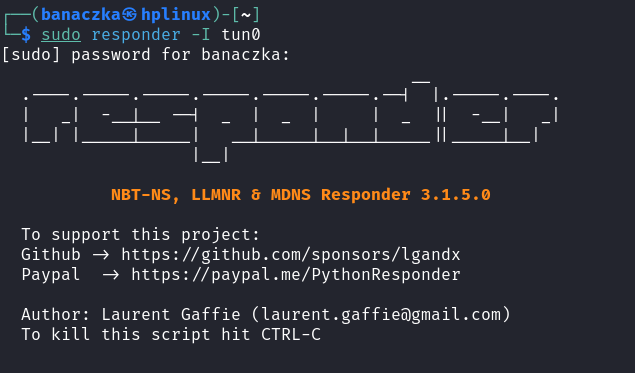
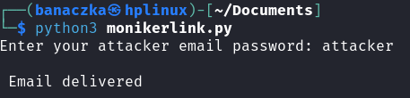
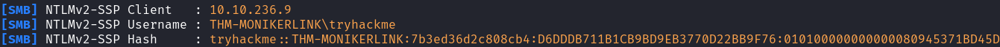

# Moniker Link (CVE-2024-21413)

**Microsoft Outlook RCE & credential leak vulnerability**

In this writeup, I'll demonstrate how to exploit CVE-2024-21413, a Remote Code Execution (RCE) vulnerability in Microsoft Outlook. The goal is to bypass Outlook's "Protected View".

To bypass Outlook's "Protected View", we need to create an email with Moniker Link containing `!` character.

Victim will attempt to load a file from our computer, connect to us via SMB using local credentials and basically send us a netNTLMv2 hash

We will use CNMatic's PoC from his GitHub [here](https://github.com/CMNatic/CVE-2024-21413)

## Set up SMB Listener

Next, use Responder to create SMB listener. Let's use `tun0` interface, as it is connected to target

On the target machine we have an Outlook app. Let's open it.

## Configure script

Switch back to our machine and modify Python script a bit. We need to replace `ATTACKER_MACHINE` with our OpenVPN IP and `MAILSERVER` with target IP

## Send email

For this room, we have SMTP server set up. We just need to use fake email `attacker@monikerlink.thm` with password `attacker` to send a malicious message

Let's run our script:

## Attack

If everything went right, we would see a new email. Read it, and click on the "Click me" link.

Return to our linux machine and Responder. We should see the captured netNTLMv2 hash in the terminal:

At this point, the victim's credentials are leaked, and the NTLMv2 hash should appear in the Responder's output.

That was my first-ever writeup. I will do better next time. This one was strongly "guided" and "inspired" (copied lol) by the THM "MonikerLink" room.